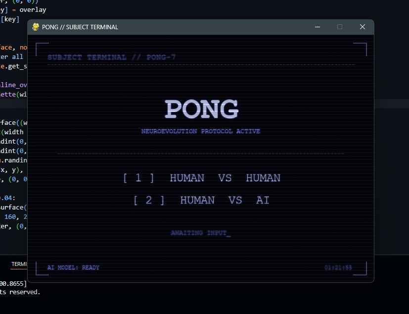
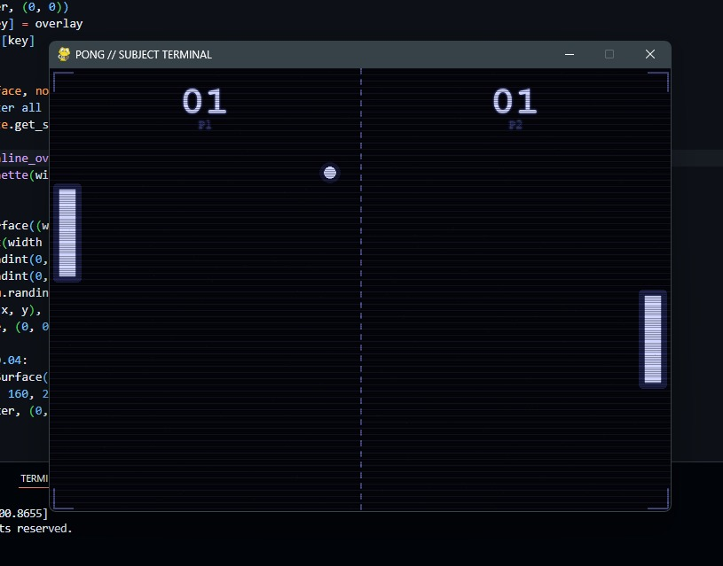

# pongAI

AI learns to play Pong using NEAT (NeuroEvolution of Augmenting Topologies) and Pygame.

Two neural networks are evolved against each other over many generations until they learn to track and return the ball. The best-performing network is saved and can then be played against by a human.

## Table of Contents

- [Overview](#overview)
- [Project Structure](#project-structure)
- [Requirements](#requirements)
- [Setup](#setup)
- [Training the AI](#training-the-ai)
- [Playing the Game](#playing-the-game)
- [Controls](#controls)
- [How It Works](#how-it-works)
- [Configuration](#configuration)
- [Notes](#notes)

## Overview

This project has two parts:

1. **Training** (`neat_pong.py`) — runs the NEAT algorithm. A population of neural networks plays Pong against each other, generation after generation. Networks that hit the ball more often and score points get higher fitness and are more likely to pass their traits to the next generation. After training, the best network is saved to `best.pickle`.
2. **Playing** (`main.py`) — loads `best.pickle` and lets a human play against the trained AI, or against another human locally.

## Images



 
## Project Structure

```
pongAI/
├── main.py          # menu and play loop (human vs human, human vs AI)
├── neat_pong.py      # NEAT training loop
├── config.txt        # NEAT hyperparameters
├── best.pickle        # saved trained network (created after training)
├── .gitignore
├── README.md
└── game/
    ├── __init__.py
    ├── game.py         # core game state, scoring, collisions
    ├── paddle.py       # paddle class
    └── ball.py         # ball physics and movement
```

## Requirements

- Python 3.10 or later
- pygame
- neat-python

## Setup

Clone the repository and install dependencies:

```
git clone https://github.com/subhamdas2806/pongAI.git
cd pongAI
pip install pygame neat-python
```

## Training the AI

Run the training script:

```
python neat_pong.py
```

This starts NEAT with a population of 50 networks (configurable in `config.txt`). Each generation, every network plays a short match against others in the population. Progress is printed to the terminal, including average and best fitness per generation.

Training runs for 50 generations by default and takes roughly 2 minutes on a typical machine. When it finishes, a `best.pickle` file is created in the project root containing the best-performing network found.

You do not need to retrain if `best.pickle` already exists, unless you want to generate a new one.

## Playing the Game

Once `best.pickle` exists, run:

```
python main.py
```

A menu will appear with two options:

- **1** — Human vs Human
- **2** — Human vs AI (loads `best.pickle`)

If you choose Human vs AI before training has been run, the game will print a message asking you to run `neat_pong.py` first.

## Controls

| Player        | Move Up | Move Down |
|---------------|---------|-----------|
| Left paddle   | W       | S         |
| Right paddle  | Up Arrow | Down Arrow |

In Human vs AI mode, the right paddle is controlled by the trained network and the arrow keys have no effect on it.

## How It Works

Each network receives three inputs every frame:

- its own paddle's y position
- the ball's y position
- the horizontal distance between the paddle and the ball

It outputs one of three decisions: stay still, move up, or move down. During training, a network's fitness increases based on how many times it hits the ball and whether it scores. Over generations, NEAT mutates and recombines network structures, gradually producing networks that track the ball more accurately.

## Configuration

`config.txt` controls the NEAT algorithm's behavior, including:

- `pop_size` — number of networks per generation
- `fitness_threshold` — fitness value at which training is considered solved
- `num_hidden` — initial number of hidden nodes
- mutation and mating rates for weights, biases, and network structure

Adjusting these values changes how quickly and how reliably the AI learns. Lower thresholds or smaller populations train faster but may produce weaker players.

## Notes

This project is built on the structure of [techwithtim/NEAT-Pong-Python](https://github.com/techwithtim/NEAT-Pong-Python), with fixes to the ball physics, a completed training script, and an added menu for human vs AI play.